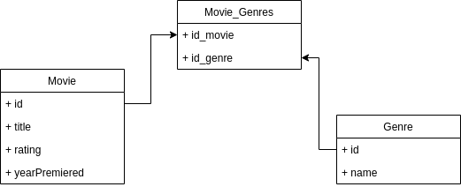

# MovieStorage

## Architecture

The application consists in 2 main parts:

1. API: A simple SpringBoot application that creates some endpoints to manipulate data (see API Enpoints section).
2. Database: An in-memory H2 database is used to store data.

## Data model

## API Endpoints

### Get movie
- URL: /getMovies
- Params: N/A
- HTTP Method: GET
- Description: Returns the movies saved

### Save movie
- URL: /saveMovie
- Params: N/A
- HTTP Method: POST
- Description: Saves the movie defined as JSON in the request body

### Update movie
- URL: /updateMovie
- Params: id -> ID of the movie you want to update
- HTTP Method: PUT
- Description: Updates the movie which ID is specified as parameter.

### Delete movie
- URL: /deleteMovie
- Params: id -> ID of the movie you want to delete
- HTTP Method: DELETE
- Description: Deletes the movie which ID is specified as parameter.